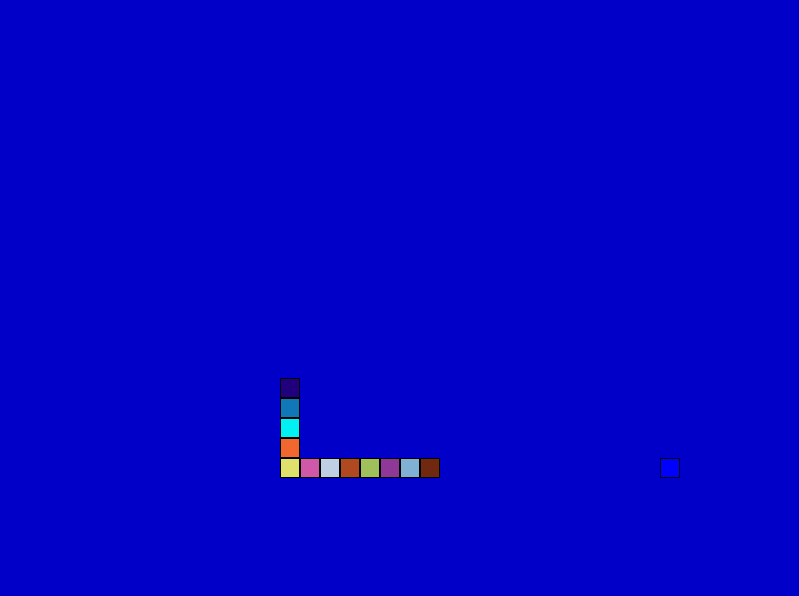

# igSnake1234

## Notes

* This is a simple snake game created for
  [1234 bytes game](http://gynvael.coldwind.pl/?id=624) competition.
  I've submitted this [commit](https://github.com/sstefanski2/igSnake1234/blob/1ce35cad62c9ccc82e44bbbabddfcdb1b7008f9f/igSnake1234.exe).
* Runs in fullscreen 800x600.
* Tested only under Win10 64-bit.
* As a bonus I've added similar version in OpenGL which is over 1234 bytes.

## Helpful resources during development time

* [1K-Mandelbrot](http://www.humus.name/index.php?page=3D&ID=85)
* [Double buffering @ snipd.net](http://snipd.net/double-buffering-with-a-back-buffer-in-vc)

## Building

* Install [VS C++ 2015](https://www.visualstudio.com/en-us/products/visual-studio-community-vs.aspx)
  (Remember to set proper location in `build.bat` if necessary).
* Download [Crinkler](http://crinkler.net/) and copy to this folder.
* Execute `build.cmd`.

## Coding/optimization notes

### rand / GetTickCount

* If computer is running around 49 days then
  [GetTickCount](https://msdn.microsoft.com/pl-pl/library/windows/desktop/ms724408.aspx)
  might cause problems.

* **GetTickCount** has poor resolution, but when using **QueryPerformanceCounter**
  `msvcrt.lib` and `ucrtd.lib` needs to be imported,
  which makes it a heavy solution.

* **GetTickCount** can be used similarly to **rand** function.
  Exe is not linked against **stdlib**, so use of **rand** is not possible.

* Using below **rand** implementation makes code more readable and doesn't
  affect exe size:

  ```c
  unsigned int rand()
  {
      return GetTickCount();
  }
  ```
* Here is a nice
  [rand](https://stackoverflow.com/questions/7602919/how-do-i-generate-random-numbers-without-rand-function)
  implementation, but this one makes exe size significantly bigger.

### Winapi

* There's no difference in exe size between:

  ```c
  void WINAPI WinMainCRTStartup()
  ```

  and (add to linker options /ENTRY:winmain)

  ```c
  __declspec(naked) void winmain()
  {
      // Prolog
      __asm enter 0x10, 0;
      __asm pushad;
      {
          // ...
      }
  }
  ```

* Fullscreen window is made out of textbox control.

### Linker/compiler

* Crinkler doesn't work with 64-bit .obj files.

* When tried linker from Microsoft, 64-bit exe was bigger than 32-bit one.

* Smallest minimal executable code (with only MessageBox) that I could get
  with VS C++ is 2560 bytes. It couldn't be compressed by
  [UPX](http://upx.sourceforge.net/) then.

* GCC/G++ are not suitable for small exe size.
  They are not compatible with Crinkler.

* 1234 bytes - 1150 bytes = 84 bytes, so there are still some bytes free
  to be used. :)

* Avast! sometimes gives false alerts about UPX generated execs.

### General

* Using **goto** is not that bad, it's like **jmp** in asm.
  Takes less bytes than creating a **do..while** loop.
  **do..while** is still better than **while**.

* Sometimes it's better to write decrementing **for** loop than inc.

* Moving around placement of variables in code can reduce some exe size.

* Game uses sound from location `C:\Windows\Media\chord.wav`.
  If it can't find this file, it beeps.

* <kbd>Print screen</kbd> key doesn't work with this app, but it's possible
  to make a screenshot with <kbd>F12</kbd> when `_DEBUG` is defined.
  Also check **CaptureAnImage**, I've removed its code but there is info
  where it can be found on MSDN site.

* For proper debugging I recommend creating new solution in VS and including
  there `igSnake1234.c`.

## Screenshot



